# Schéma de la Base de Données

> Vue complète des tables, relations, et logique métier.

---

## Diagramme Entité-Relation (ERD)

```mermaid
erDiagram
    USERS ||--o{ SUBSCRIPTIONS : has
    USERS ||--o{ TRAINING_USER : enrolls
    USERS ||--o{ INTERCLUB_USER : participates
    USERS ||--o{ TOURNAMENT_USER : registers
    USERS ||--o{ PAYMENT : has
    USERS ||--o{ MEETING_USER : attends
    USERS ||--o{ TEAM_USER : belongs
    USERS ||--o{ TRAINING_PACK : teaches
    
    SEASONS ||--o{ SUBSCRIPTIONS : contains
    SEASONS ||--o{ TRAININGS : contains
    SEASONS ||--o{ LEAGUES : contains
    SEASONS ||--o{ TEAMS : contains
    
    TRAINING_PACKS ||--o{ TRAINING_USER : contains
    TRAINING_PACKS ||--o{ SUBSCRIPTION_TRAINING_PACK : linked
    TRAINING_PACKS ||--o{ TRAININGS : spawns
    
    TRAININGS ||--o{ TRAINING_USER : enrolls
    
    CLUBS ||--o{ ROOMS : has
    CLUBS ||--o{ TEAMS : has
    
    ROOMS ||--o{ TRAININGS : hosts
    ROOMS ||--o{ INTERCLUBS : hosts
    ROOMS ||--o{ TABLES : contains
    
    TABLES ||--o{ TABLE_TOURNAMENT : used_in
    
    LEAGUES ||--o{ TEAMS : contains
    TEAMS ||--o{ TEAM_USER : has
    TEAMS ||--o{ MATCH_RESULTS : records
    TEAMS ||--o{ INTERCLUBS : plays
    
    INTERCLUBS ||--o{ INTERCLUB_USER : selects
    
    TOURNAMENTS ||--o{ TOURNAMENT_USER : registers
    TOURNAMENTS ||--o{ POOLS : organizes
    TOURNAMENTS ||--o{ TOURNAMENT_MATCHES : contains
    
    POOLS ||--o{ TOURNAMENT_MATCHES : contains
    POOLS ||--o{ POOL_USER : contains
    
    TOURNAMENT_MATCHES ||--o{ MATCH_SETS : has
    TOURNAMENT_MATCHES ||--o{ TABLE_TOURNAMENT : uses
    
    MEETINGS ||--o{ MEETING_USER : invites
    MEETINGS ||--o{ MEETING_AGENDA_ITEMS : contains
    MEETINGS ||--o{ MEETING_DATE_PROPOSALS : receives
    MEETINGS ||--o{ MEETING_ACTION_ITEMS : has
    MEETINGS ||--o{ MEETING_MINUTES : documents
    
    MEETING_DATE_PROPOSALS ||--o{ MEETING_DATE_VOTES : votes
    
    SUBSCRIPTIONS ||--o{ SUBSCRIPTION_TRAINING_PACK : selects
    SUBSCRIPTIONS ||--o{ PAYMENT : records
    
    PAYMENTS ||--o{ TOURNAMENT_USER : pays
    PAYMENTS ||--o{ REGISTRATIONS : pays
    
    TOURNAMENTS ||--o{ REGISTRATIONS : accepts
    TOURNAMENTS ||--o{ EVENT_POSTS : announces
    TRAININGS ||--o{ EVENT_POSTS : announces
    MEETINGS ||--o{ EVENT_POSTS : announces
    INTERCLUBS ||--o{ EVENT_POSTS : announces
    
    NEWS_POSTS ||--o{ USERS : authored_by
    EVENT_POSTS ||--o{ USERS : authored_by
    
    CONTACTS ||--o{ USERS : becomes
```

---

## Tables principales par domaine

### COMPETITIONS

#### `teams`
- `id`, `name`, `league_id`, `club_id`, `captain_id`, `season_id`
- `final_position`

#### `leagues`
- `id`, `division`, `level`, `category`, `season_id`

#### `interclubs`
- `id`, `address`, `start_date_time`, `week_number`
- `total_players`, `score`, `result`
- `visited_team_id`, `visiting_team_id`, `room_id`, `league_id`, `season_id`

#### `interclub_user` (Selection polymorphe)
- `user_id`, `interclub_id`
- `is_subscribed` (joueur s'est manifesté), `is_selected` (confirmé), `has_played`
- `availability` (available/unavailable/uncertain), `selection_confirmed_at`

#### `match_results` (Résultats ligue)
- `team_id`, `season_id`, `match_date`, `week_number`
- `is_home`, `opponent_name`, `score`, `result`, `is_bye`

#### `match_sets` (Détail matchs tournoi)
- `tournament_match_id`, `set_number`, `player1_score`, `player2_score`, `winner_id`

#### `tournament_matches`
- `pool_id`, `tournament_id`, `player1_id`, `player2_id`, `winner_id`
- `status` (scheduled/in_progress/completed), `started_ad`, `scheduled_time`
- `pair1_id`, `pair2_id`, `referee_id`, `is_forfeit`

#### `tournament_pairs`
- `tournament_id`, `player1_id`, `player2_id`, `registered_by`

---

### TRAININGS

#### `training_packs`
- `id`, `name`, `season_id`, `price`, `level`, `type`
- `room_id`, `trainer_id`, `day_of_week`, `start_time`, `duration_minutes`
- `max_participants`, `is_active`
- `pack_start_date`, `pack_end_date`, `excluded_dates`
- `allow_discount`, `is_open_enrollment`

#### `trainings`
- `id`, `level`, `type`, `start`, `end`, `room_id`, `trainer_id`, `season_id`
- `training_pack_id`, `status` (scheduled/in_progress/completed/cancelled)
- `cancellation_note`, `cancelled_at`

#### `training_user`
- `training_id`, `user_id`, `status` (registered/attended/absent)

---

### MEETINGS

#### `meetings`
- `id`, `title`, `type` (AG/comité/festive), `status`
- `format` (en_personne/zoom/hybride), `is_public`
- `description`, `scheduled_at`, `ends_at`, `location`, `meeting_link`
- `rsvp_deadline`, `has_meal`, `meal_description`, `meal_price_cents`
- `quorum`, `cancellation_note`, `postponed_note`, `postponed_to`
- `created_by`

#### `meeting_user`
- `meeting_id`, `user_id`, `status` (invited/declined/accepted)
- `invitation_sent_at`, `response_at`

#### `meeting_date_proposals`
- `meeting_id`, `proposed_at`, `is_selected`

#### `meeting_date_votes`
- `meeting_date_proposal_id`, `user_id`, `vote` (yes/no/uncertain)

#### `meeting_agenda_items`
- `meeting_id`, `sort_order`, `title`, `description`

#### `meeting_action_items`
- `meeting_id`, `title`, `description`, `assigned_to_id`, `due_date`, `is_completed`

#### `meeting_minutes`
- `meeting_id`, `announcements`, `decisions`, `notes`
- `is_published`, `published_at`, `published_by`
- `sent_to_committee_at`, `sent_to_all_at`

---

### SUBSCRIPTIONS / MEMBERSHIPS

#### `subscriptions`
- `id`, `season_id`, `user_id`, `status` (pending/confirmed/paid/cancelled)
- `is_competitive`, `has_other_family_members`, `trainings_count`
- `subscription_price`, `training_unit_price`
- `amount_due`, `amount_paid`
- `deleted_at`

#### `subscription_training_pack`
- `subscription_id`, `training_pack_id`
- `status` (active/waitlisted), `waitlist_position`, `confirmation_deadline`
- `discount` (boolean)

#### `payments`
- `id`, `reference`, `transaction_id`, `amount_due`, `amount_paid`
- `status` (unpaid/paid/partially_paid/refunded/cancelled)
- `payable_type`, `payable_id` (polymorphe: Subscription, Registration, Interclub, etc.)
- `payment_method`, `invitation_counter`, `refund_transaction_id`

#### `registrations` (Inscriptions à des événements payants)
- `id`, `event_post_id`, `user_id`
- `amount_due`, `amount_paid`, `status`

#### `contacts` (Leads / prospects)
- `id`, `first_name`, `last_name`, `email`, `phone`
- `interest`, `message`, `membership_family_members`, `membership_competitors`
- `membership_training_sessions`, `membership_total_cost`
- `status` (new/contacted/interested/rejected), `owner_id`

#### `users`
- `id`, `email`, `password`, `email_verified_at`
- `first_name`, `last_name`, `gender`, `birthdate`, `phone_number`
- `street`, `city_code`, `city_name`, `club_id`
- `is_active`, `is_admin`, `is_committee_member`, `is_competitor`, `is_coach`
- `has_paid`, `avatar_url`, `theme`, `emails_notifications`
- `family_id`, `is_family_owner`
- `ranking`, `licence`, `force_list`
- `guardian_phone_number`, `medical_certificate_path`, `parental_consent_path`
- `committee_role` (président/secrétaire/trésorier/administrateur/sélectionneur)
- `iban`

---

### COMMUNICATION

#### `news_posts`
- `id`, `title`, `slug`, `content`, `category`, `image`
- `user_id`, `status` (draft/published), `is_public`
- `deleted_at`

#### `event_posts` (Posts polymorphes)
- `id`, `eventable_type`, `eventable_id` (Tournament/Training/Meeting/Interclub)
- `type` (announcement/review/other), `title`, `description`
- `status` (draft/published/archived), `event_date`, `start_time`, `end_time`
- `location`, `price`, `icon`, `max_participants`
- `notes`, `featured`, `featured_until`

---

### RESOURCES

#### `rooms`
- `id`, `name`, `building_name`, `street`, `city_code`, `city_name`, `floor`
- `access_description`
- `capacity_for_trainings`, `capacity_for_interclubs`, `total_tables`, `total_playable_tables`

#### `tables`
- `id`, `name`, `room_id`, `purchased_on`, `state`, `state_description`
- `brand`, `model`, `is_available`

#### `club_room`
- `club_id`, `room_id`

#### `table_tournament`
- `tournament_id`, `table_id`, `tournament_match_id`, `is_table_free`
- `match_started_at`, `match_ended_at`

---

### INFRASTRUCTURE

#### `clubs`
- `id`, `name`, `is_active`, `licence`, `email_contact`, `phone_contact`
- `street`, `city_code`, `city_name`, `building_name`
- `latitude`, `longitude`, `bank_account`, `website_url`, `enterprise_number`

#### `seasons`
- `id`, `name`, `start_at`, `end_at`, `is_active`, `registrations_open`

#### `app_settings`
- `key` (config values), `value`

#### `spams`
- `ip`, `user_agent`, `inputs`, `is_blocked`

#### `tournaments`
- `id`, `name`, `description`, `start_date`, `end_date`, `start_time`, `duration_minutes`
- `total_users`, `max_users`, `price`, `status`
- `location`, `image`, `objective`, `registration_deadline`
- `pool_size`, `nb_pools`, `nb_qualifiers_per_pool`, `sets_to_win`
- `logistics_buffer_minutes`, `match_type`, `news_post_id`
- `has_handicap_points`, `deuce_enabled`, `doubles_registration_mode`

#### `pools`
- `id`, `name`, `tournament_id`

#### `pool_pair`
- `pool_id`, `tournament_pair_id`

#### `pool_user`
- `pool_id`, `user_id`

#### `tournament_user`
- `user_id`, `tournament_id`, `has_paid`
- `registration_status` (registered/waitlisted/confirmed/cancelled)
- `waitlist_position`, `confirmation_deadline`, `payment_deadline`
- `payment_id`, `qr_confirmed`

#### `tournament_invitations`
- `tournament_id`, `user_count`, `message`, `include_article`, `sent_at`

---

## Relations clés

### Polymorphiques
- **`payments.payable`**: peut pointer vers `subscriptions`, `registrations`, `interclubs`, etc.
- **`event_posts.eventable`**: peut pointer vers `tournaments`, `trainings`, `meetings`, `interclubs`
- **`interclub_user`**: représente le polymorphe "selection" (joueur candidat, sélectionné, a joué)

### Hiérarchies
- `Season` → `League` → `Team` → `TeamUser`
- `Season` → `TrainingPack` → `Training` → `TrainingUser`
- `Season` → `Subscription` → `SubscriptionTrainingPack` → `Payment`
- `Meeting` → `MeetingDateProposal` → `MeetingDateVote`

### Transversaux
- **Users**: central, lié à tous les domaines
- **Seasons**: organise tout (teams, trainings, subscriptions, tournaments)
- **Rooms/Tables**: ressources partagées utilisées partout
- **Payments**: transversal, peut couvrir plusieurs domaines

---

## Statuts et Enums principaux

### Payment Status
- `unpaid` → `partially_paid` → `paid` → `refunded` / `cancelled`

### Meeting Status
- `planning` → `date_voting` → `scheduled` → `in_progress` → `completed`

### Subscription Status
- `pending` → `confirmed` → `paid` → `cancelled`

### Tournament Status
- `planning` → `open_registration` → `in_progress` → `completed` / `cancelled`

### Training Status
- `scheduled` → `in_progress` → `completed` / `cancelled`

### Interclub Status
- `planning` → `open_subscriptions` → `in_progress` → `result_published`

### User Role
- `admin` (IT), `committee_member` (comité), `competitor`, `coach`
- `committee_role`: `président`, `secrétaire`, `trésorier`, `administrateur`, `sélectionneur`

