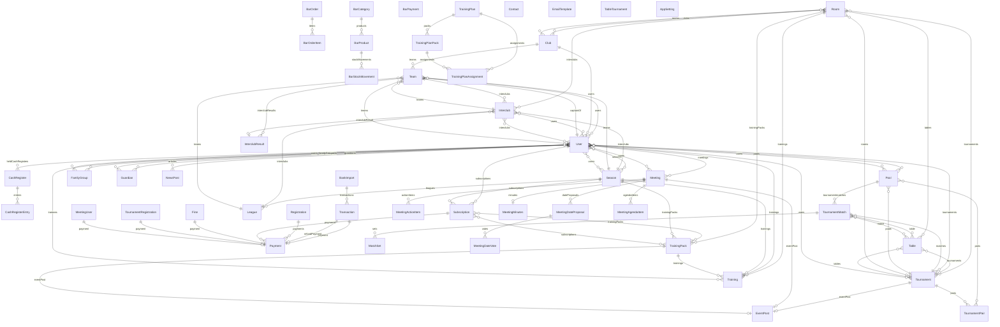

# Entity-Relationship Diagram — Vue globale

```mermaid
erDiagram
    %% Bar
    BarCategory
    BarOrder
    BarOrderItem
    BarPayment
    BarProduct
    BarStockMovement

    %% ClubAdmin/Club
    Room
    Table

    %% ClubAdmin/Contact
    Contact
    EmailTemplate

    %% ClubAdmin/Payment
    BankImport
    CashRegisterEntry
    Payment
    Transaction
    CashRegister

    %% ClubAdmin/Subscriptions
    Registration
    Subscription

    %% ClubAdmin/Users
    FamilyGroup
    Guardian
    User

    %% ClubAdmin/Fines
    Fine

    %% ClubPosts
    NewsPost
    EventPost

    %% Competitions/Interclub
    InterclubResult
    League
    Season
    Team
    Club
    Interclub

    %% Competitions/Tournament
    MatchSet
    Pool
    TableTournament
    Tournament
    TournamentMatch
    TournamentPair
    TournamentRegistration

    %% Meetings
    MeetingActionItem
    MeetingDateProposal
    MeetingDateVote
    MeetingMinutes
    MeetingUser
    MeetingAgendaItem
    Meeting

    %% Shared
    AppSetting

    %% Trainings
    Training
    TrainingPlan
    TrainingPlanAssignment
    TrainingPlanPack
    TrainingPack

    BarCategory ||--o{ BarProduct : "products"
    BarOrder ||--o{ BarOrderItem : "items"
    BarProduct ||--o{ BarStockMovement : "stockMovements"
    Room }o--o{ Club : "clubs"
    Room ||--o{ Interclub : "interclubs"
    Room ||--o{ Table : "tables"
    Room }o--o{ Tournament : "tournaments"
    Room ||--o{ TrainingPack : "trainingPacks"
    Room ||--o{ Training : "trainings"
    Table }o--o{ TournamentMatch : "match"
    Table }o--o{ Tournament : "tournaments"
    BankImport ||--o{ Transaction : "transactions"
    Transaction ||--o| Payment : "payment"
    Transaction ||--o| Payment : "refundPayment"
    CashRegister ||--o{ CashRegisterEntry : "entries"
    Registration ||--o{ Payment : "payments"
    Subscription ||--o{ Payment : "payments"
    Subscription }o--o{ TrainingPack : "trainingPacks"
    FamilyGroup }o--o{ User : "users"
    Guardian }o--o{ User : "users"
    User ||--o{ NewsPost : "articles"
    User ||--o| Team : "captainOf"
    User }o--o{ FamilyGroup : "familyGroups"
    User }o--o{ Guardian : "guardians"
    User ||--o{ CashRegister : "heldCashRegisters"
    User }o--o{ Interclub : "interclubs"
    User }o--o{ Meeting : "meetings"
    User }o--o{ Pool : "pools"
    User }o--o{ Season : "seasons"
    User ||--o{ Subscription : "subscriptions"
    User }o--o{ Team : "teams"
    User }o--o{ Tournament : "tournaments"
    User }o--o{ Training : "trainings"
    Fine ||--o| Payment : "payment"
    League ||--o{ Interclub : "interclubs"
    League ||--o{ Team : "teams"
    Season ||--o{ Interclub : "interclubs"
    Season ||--o{ League : "leagues"
    Season ||--o{ Subscription : "subscriptions"
    Season ||--o{ Team : "teams"
    Season ||--o{ TrainingPack : "trainingPacks"
    Season ||--o{ Training : "trainings"
    Season }o--o{ User : "users"
    Team ||--o{ InterclubResult : "interclubResults"
    Team ||--o{ Interclub : "interclubs"
    Team }o--o{ User : "users"
    Club }o--o{ Room : "rooms"
    Club ||--o{ Team : "teams"
    Club ||--o{ User : "users"
    Interclub ||--o| InterclubResult : "interclubResult"
    Interclub ||--o{ Team : "teams"
    Interclub }o--o{ User : "users"
    Pool }o--o{ TournamentPair : "pairs"
    Pool ||--o{ TournamentMatch : "tournamentmatches"
    Pool }o--o{ User : "users"
    Tournament ||--o| EventPost : "eventPost"
    Tournament ||--o{ TournamentMatch : "matches"
    Tournament ||--o{ TournamentPair : "pairs"
    Tournament ||--o{ Pool : "pools"
    Tournament }o--o{ Room : "rooms"
    Tournament }o--o{ Table : "tables"
    Tournament }o--o{ User : "users"
    TournamentMatch ||--o{ MatchSet : "sets"
    TournamentMatch }o--o{ Table : "table"
    TournamentRegistration ||--o| Payment : "payment"
    MeetingDateProposal ||--o{ MeetingDateVote : "votes"
    MeetingUser ||--o| Payment : "payment"
    Meeting ||--o{ MeetingActionItem : "actionItems"
    Meeting ||--o{ MeetingAgendaItem : "agendaItems"
    Meeting ||--o{ MeetingDateProposal : "dateProposals"
    Meeting ||--o| EventPost : "eventPost"
    Meeting ||--o| MeetingMinutes : "minutes"
    Meeting }o--o{ User : "users"
    Training }o--o{ User : "trainees"
    TrainingPlan ||--o{ TrainingPlanAssignment : "assignments"
    TrainingPlan ||--o{ TrainingPlanPack : "packs"
    TrainingPlanPack ||--o{ TrainingPlanAssignment : "assignments"
    TrainingPack ||--o| EventPost : "eventPost"
    TrainingPack }o--o{ Subscription : "subscriptions"
    TrainingPack ||--o{ Training : "trainings"
```
