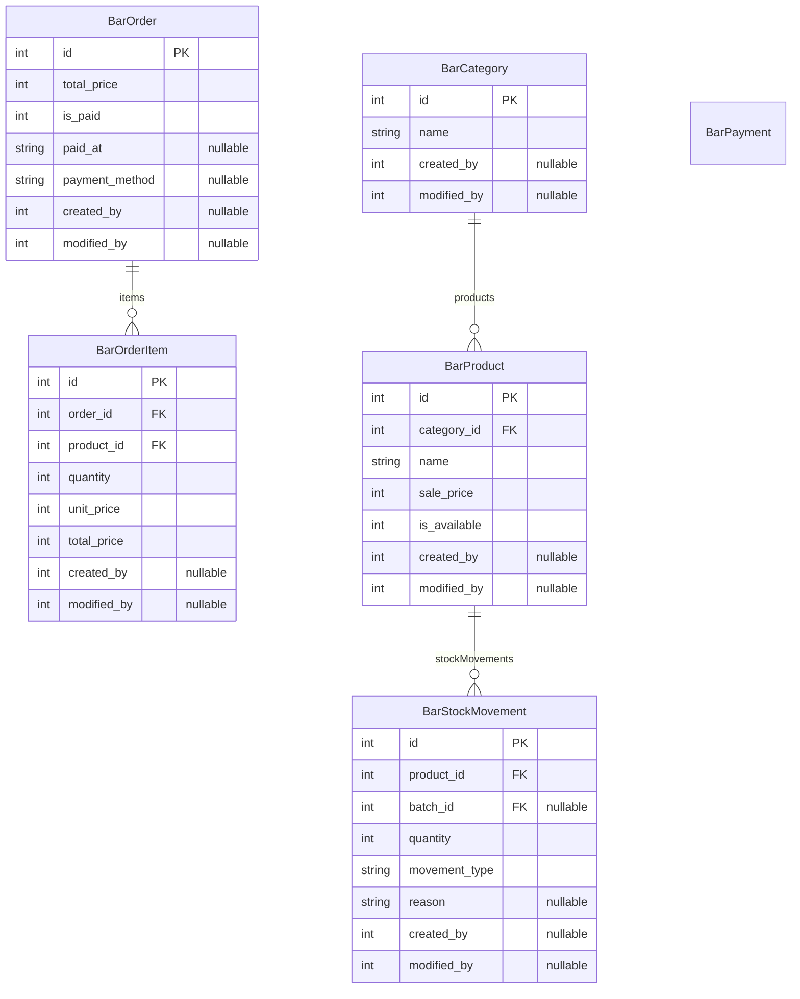

# ERD — Bar

```mermaid
erDiagram
    BarCategory {
        int id PK
        string name
        int created_by "nullable"
        int modified_by "nullable"
    }
    BarOrder {
        int id PK
        int total_price
        int is_paid
        string paid_at "nullable"
        string payment_method "nullable"
        int created_by "nullable"
        int modified_by "nullable"
    }
    BarOrderItem {
        int id PK
        int order_id FK
        int product_id FK
        int quantity
        int unit_price
        int total_price
        int created_by "nullable"
        int modified_by "nullable"
    }
    BarPayment {
    }
    BarProduct {
        int id PK
        int category_id FK
        string name
        int sale_price
        int is_available
        int created_by "nullable"
        int modified_by "nullable"
    }
    BarStockMovement {
        int id PK
        int product_id FK
        int batch_id FK "nullable"
        int quantity
        string movement_type
        string reason "nullable"
        int created_by "nullable"
        int modified_by "nullable"
    }

    BarCategory ||--o{ BarProduct : "products"
    BarOrder ||--o{ BarOrderItem : "items"
    BarProduct ||--o{ BarStockMovement : "stockMovements"
```
