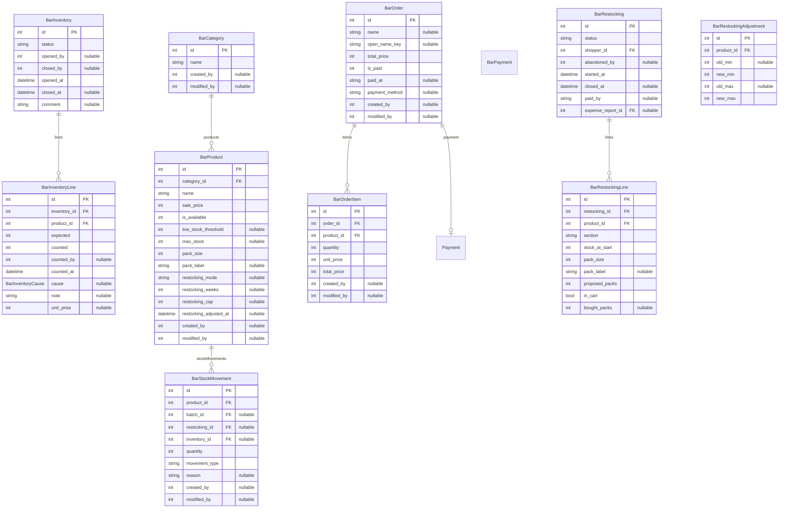

# ERD — Bar

```mermaid
erDiagram
    BarCategory {
        int id PK
        string name
        int created_by "nullable"
        int modified_by "nullable"
    }
    BarInventory {
        int id PK
        string status
        int opened_by "nullable"
        int closed_by "nullable"
        datetime opened_at
        datetime closed_at "nullable"
        string comment "nullable"
    }
    BarInventoryLine {
        int id PK
        int inventory_id FK
        int product_id FK
        int expected
        int counted
        int counted_by "nullable"
        datetime counted_at
        BarInventoryCause cause "nullable"
        string note "nullable"
        int unit_price "nullable"
    }
    BarOrder {
        int id PK
        string name "nullable"
        string open_name_key "nullable"
        int total_price
        int is_paid
        string paid_at "nullable"
        string payment_method "nullable"
        int created_by "nullable"
        int modified_by "nullable"
    }
    BarOrderItem {
        int id PK
        int order_id FK
        int product_id FK
        int quantity
        int unit_price
        int total_price
        int created_by "nullable"
        int modified_by "nullable"
    }
    BarPayment {
    }
    BarProduct {
        int id PK
        int category_id FK
        string name
        int sale_price
        int is_available
        int low_stock_threshold "nullable"
        int max_stock "nullable"
        int pack_size
        string pack_label "nullable"
        string restocking_mode "nullable"
        int restocking_weeks "nullable"
        int restocking_cap "nullable"
        datetime restocking_adjusted_at "nullable"
        int created_by "nullable"
        int modified_by "nullable"
    }
    BarRestocking {
        int id PK
        string status
        int shopper_id FK
        int abandoned_by "nullable"
        datetime started_at
        datetime closed_at "nullable"
        string paid_by "nullable"
        int expense_report_id FK "nullable"
    }
    BarRestockingAdjustment {
        int id PK
        int product_id FK
        int old_min "nullable"
        int new_min
        int old_max "nullable"
        int new_max
    }
    BarRestockingLine {
        int id PK
        int restocking_id FK
        int product_id FK
        string section
        int stock_at_start
        int pack_size
        string pack_label "nullable"
        int proposed_packs
        bool in_cart
        int bought_packs "nullable"
    }
    BarStockMovement {
        int id PK
        int product_id FK
        int batch_id FK "nullable"
        int restocking_id FK "nullable"
        int inventory_id FK "nullable"
        int quantity
        string movement_type
        string reason "nullable"
        int created_by "nullable"
        int modified_by "nullable"
    }

    BarCategory ||--o{ BarProduct : "products"
    BarInventory ||--o{ BarInventoryLine : "lines"
    BarOrder ||--o{ BarOrderItem : "items"
    BarOrder ||--o| Payment : "payment"
    BarProduct ||--o{ BarStockMovement : "stockMovements"
    BarRestocking ||--o{ BarRestockingLine : "lines"
```
