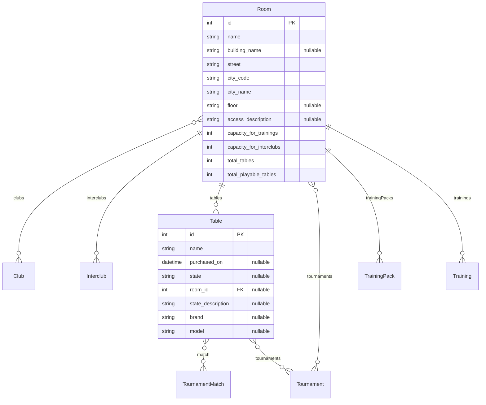

# ERD — ClubAdmin/Club

```mermaid
erDiagram
    Room {
        int id PK
        string name
        string building_name "nullable"
        string street
        string city_code
        string city_name
        string floor "nullable"
        string access_description "nullable"
        int capacity_for_trainings
        int capacity_for_interclubs
        int total_tables
        int total_playable_tables
    }
    Table {
        int id PK
        string name
        datetime purchased_on "nullable"
        string state "nullable"
        int room_id FK "nullable"
        string state_description "nullable"
        string brand "nullable"
        string model "nullable"
    }

    Room }o--o{ Club : "clubs"
    Room ||--o{ Interclub : "interclubs"
    Room ||--o{ Table : "tables"
    Room }o--o{ Tournament : "tournaments"
    Room ||--o{ TrainingPack : "trainingPacks"
    Room ||--o{ Training : "trainings"
    Table }o--o{ TournamentMatch : "match"
    Table }o--o{ Tournament : "tournaments"
```
