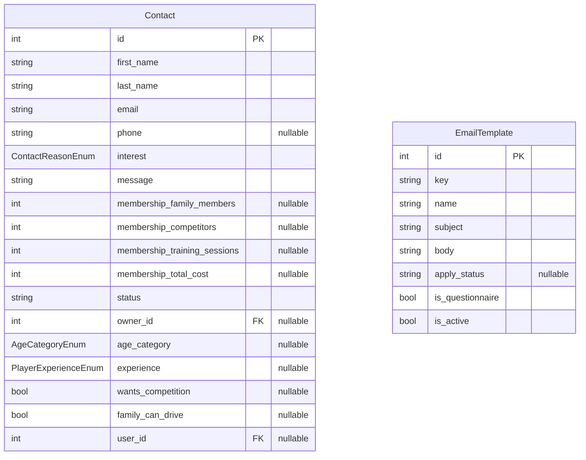

# ERD — ClubAdmin/Contact

```mermaid
erDiagram
    Contact {
        int id PK
        string first_name
        string last_name
        string email
        string phone "nullable"
        ContactReasonEnum interest
        string message
        int membership_family_members "nullable"
        int membership_competitors "nullable"
        int membership_training_sessions "nullable"
        int membership_total_cost "nullable"
        string status
        int owner_id FK "nullable"
        AgeCategoryEnum age_category "nullable"
        PlayerExperienceEnum experience "nullable"
        bool wants_competition "nullable"
        bool family_can_drive "nullable"
        int user_id FK "nullable"
    }
    EmailTemplate {
        int id PK
        string key
        string name
        string subject
        string body
        string apply_status "nullable"
        bool is_questionnaire
        bool is_active
    }

```
