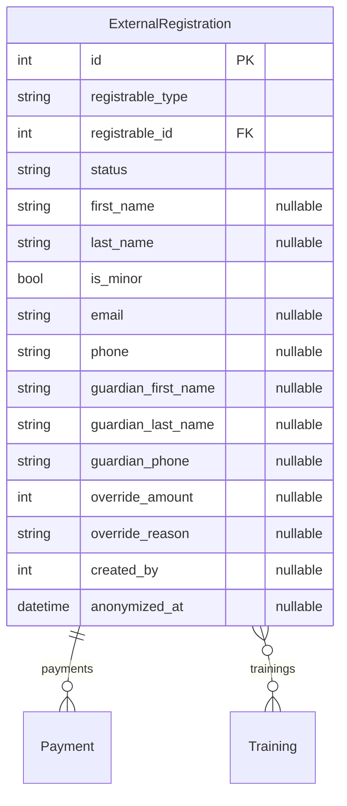

# ERD — ClubAdmin/ExternalParticipants

```mermaid
erDiagram
    ExternalRegistration {
        int id PK
        string registrable_type
        int registrable_id FK
        string status
        string first_name "nullable"
        string last_name "nullable"
        bool is_minor
        string email "nullable"
        string phone "nullable"
        string guardian_first_name "nullable"
        string guardian_last_name "nullable"
        string guardian_phone "nullable"
        int override_amount "nullable"
        string override_reason "nullable"
        int created_by "nullable"
        datetime anonymized_at "nullable"
    }

    ExternalRegistration ||--o{ Payment : "payments"
    ExternalRegistration }o--o{ Training : "trainings"
```
