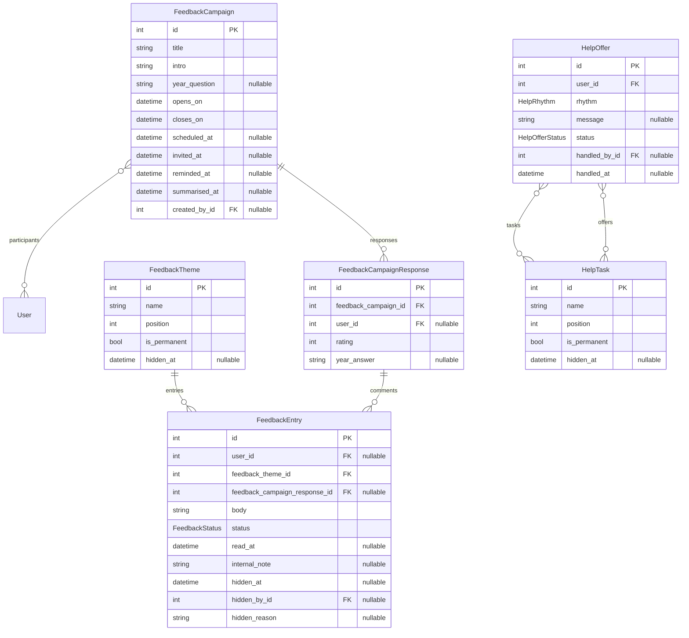

# ERD — ClubAdmin/Feedback

```mermaid
erDiagram
    FeedbackCampaign {
        int id PK
        string title
        string intro
        string year_question "nullable"
        datetime opens_on
        datetime closes_on
        datetime scheduled_at "nullable"
        datetime invited_at "nullable"
        datetime reminded_at "nullable"
        datetime summarised_at "nullable"
        int created_by_id FK "nullable"
    }
    FeedbackCampaignResponse {
        int id PK
        int feedback_campaign_id FK
        int user_id FK "nullable"
        int rating
        string year_answer "nullable"
    }
    FeedbackEntry {
        int id PK
        int user_id FK "nullable"
        int feedback_theme_id FK
        int feedback_campaign_response_id FK "nullable"
        string body
        FeedbackStatus status
        datetime read_at "nullable"
        string internal_note "nullable"
        datetime hidden_at "nullable"
        int hidden_by_id FK "nullable"
        string hidden_reason "nullable"
    }
    FeedbackTheme {
        int id PK
        string name
        int position
        bool is_permanent
        datetime hidden_at "nullable"
    }
    HelpOffer {
        int id PK
        int user_id FK
        HelpRhythm rhythm
        string message "nullable"
        HelpOfferStatus status
        int handled_by_id FK "nullable"
        datetime handled_at "nullable"
    }
    HelpTask {
        int id PK
        string name
        int position
        bool is_permanent
        datetime hidden_at "nullable"
    }

    FeedbackCampaign }o--o{ User : "participants"
    FeedbackCampaign ||--o{ FeedbackCampaignResponse : "responses"
    FeedbackCampaignResponse ||--o{ FeedbackEntry : "comments"
    FeedbackTheme ||--o{ FeedbackEntry : "entries"
    HelpOffer }o--o{ HelpTask : "tasks"
    HelpTask }o--o{ HelpOffer : "offers"
```
