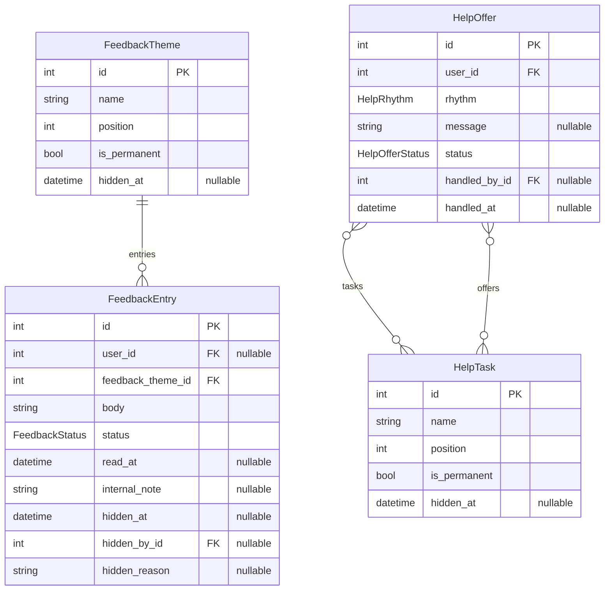

# ERD — ClubAdmin/Feedback

```mermaid
erDiagram
    FeedbackEntry {
        int id PK
        int user_id FK "nullable"
        int feedback_theme_id FK
        string body
        FeedbackStatus status
        datetime read_at "nullable"
        string internal_note "nullable"
        datetime hidden_at "nullable"
        int hidden_by_id FK "nullable"
        string hidden_reason "nullable"
    }
    FeedbackTheme {
        int id PK
        string name
        int position
        bool is_permanent
        datetime hidden_at "nullable"
    }
    HelpOffer {
        int id PK
        int user_id FK
        HelpRhythm rhythm
        string message "nullable"
        HelpOfferStatus status
        int handled_by_id FK "nullable"
        datetime handled_at "nullable"
    }
    HelpTask {
        int id PK
        string name
        int position
        bool is_permanent
        datetime hidden_at "nullable"
    }

    FeedbackTheme ||--o{ FeedbackEntry : "entries"
    HelpOffer }o--o{ HelpTask : "tasks"
    HelpTask }o--o{ HelpOffer : "offers"
```
