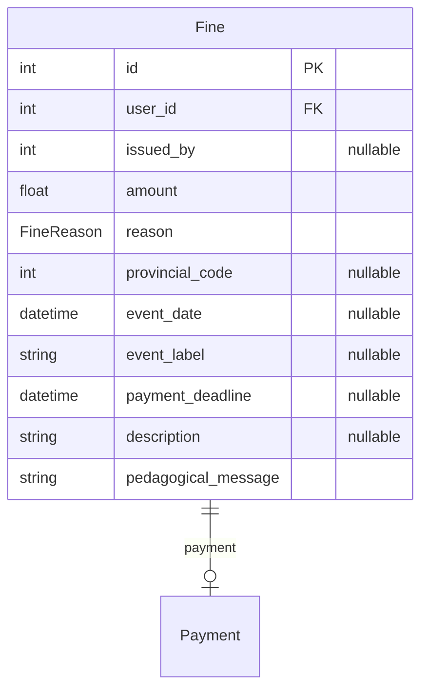

# ERD — ClubAdmin/Fines

```mermaid
erDiagram
    Fine {
        int id PK
        int user_id FK
        int issued_by "nullable"
        float amount
        FineReason reason
        int provincial_code "nullable"
        datetime event_date "nullable"
        string event_label "nullable"
        datetime payment_deadline "nullable"
        string description "nullable"
        string pedagogical_message
    }

    Fine ||--o| Payment : "payment"
```
