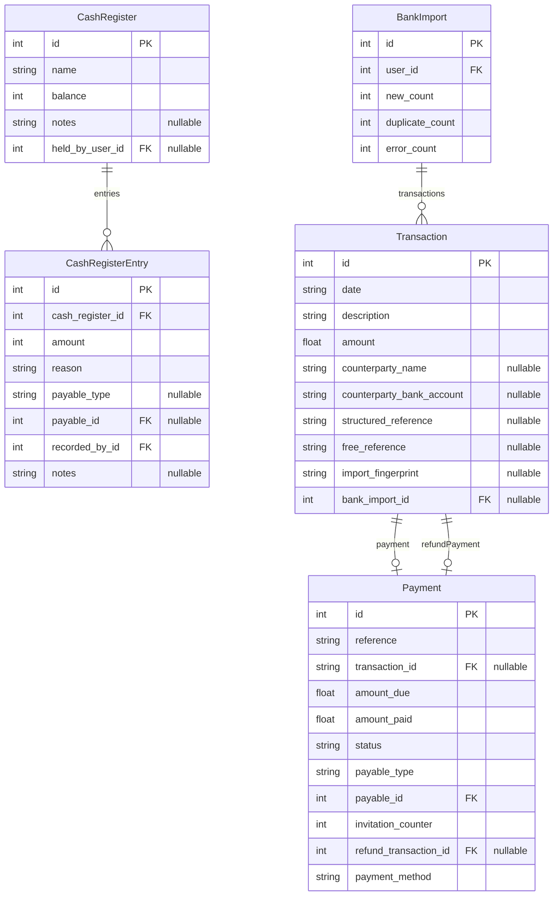

# ERD — ClubAdmin/Payment

```mermaid
erDiagram
    BankImport {
        int id PK
        int user_id FK
        int new_count
        int duplicate_count
        int error_count
    }
    CashRegister {
        int id PK
        string name
        int balance
        string notes "nullable"
        int held_by_user_id FK "nullable"
    }
    CashRegisterEntry {
        int id PK
        int cash_register_id FK
        int amount
        string reason
        string payable_type "nullable"
        int payable_id FK "nullable"
        int recorded_by_id FK
        string notes "nullable"
    }
    Payment {
        int id PK
        string reference
        string transaction_id FK "nullable"
        float amount_due
        float amount_paid
        string status
        string payable_type
        int payable_id FK
        int invitation_counter
        int refund_transaction_id FK "nullable"
        string payment_method
    }
    Transaction {
        int id PK
        string date
        string description
        float amount
        string counterparty_name "nullable"
        string counterparty_bank_account "nullable"
        string structured_reference "nullable"
        string free_reference "nullable"
        string import_fingerprint "nullable"
        int bank_import_id FK "nullable"
    }

    BankImport ||--o{ Transaction : "transactions"
    CashRegister ||--o{ CashRegisterEntry : "entries"
    Transaction ||--o| Payment : "payment"
    Transaction ||--o| Payment : "refundPayment"
```
