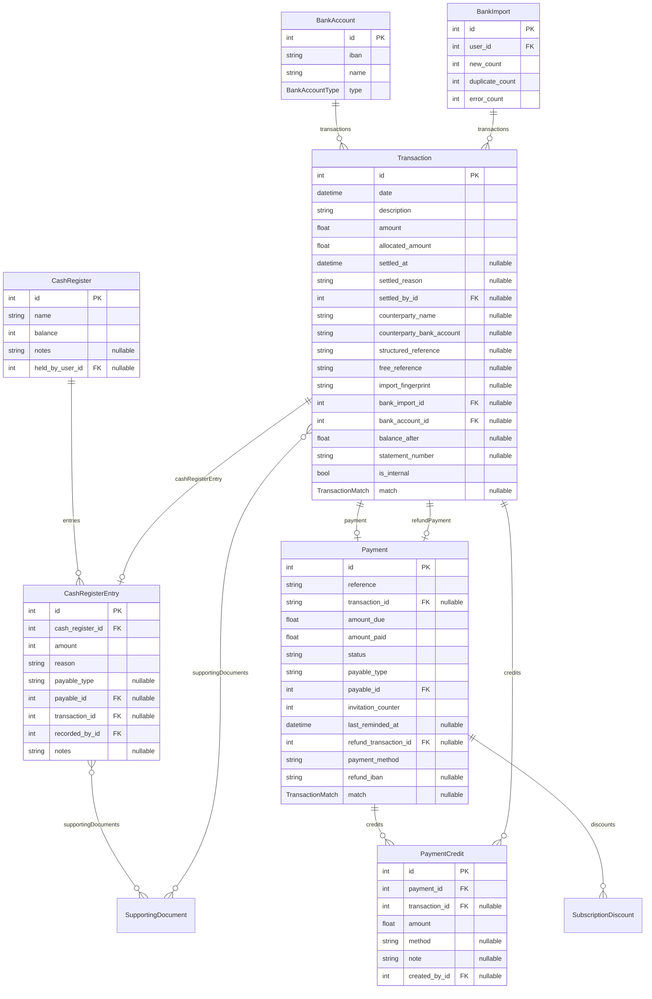

# ERD — ClubAdmin/Payment

```mermaid
erDiagram
    BankAccount {
        int id PK
        string iban
        string name
        BankAccountType type
    }
    BankImport {
        int id PK
        int user_id FK
        int new_count
        int duplicate_count
        int error_count
    }
    CashRegister {
        int id PK
        string name
        int balance
        string notes "nullable"
        int held_by_user_id FK "nullable"
    }
    CashRegisterEntry {
        int id PK
        int cash_register_id FK
        int amount
        string reason
        string payable_type "nullable"
        int payable_id FK "nullable"
        int transaction_id FK "nullable"
        int recorded_by_id FK
        string notes "nullable"
    }
    Payment {
        int id PK
        string reference
        string transaction_id FK "nullable"
        float amount_due
        float amount_paid
        string status
        string payable_type
        int payable_id FK
        int invitation_counter
        datetime last_reminded_at "nullable"
        int refund_transaction_id FK "nullable"
        string payment_method
        string refund_iban "nullable"
        TransactionMatch match "nullable"
    }
    PaymentCredit {
        int id PK
        int payment_id FK
        int transaction_id FK "nullable"
        float amount
        string method "nullable"
        string note "nullable"
        int created_by_id FK "nullable"
    }
    Transaction {
        int id PK
        datetime date
        string description
        float amount
        float allocated_amount
        datetime settled_at "nullable"
        string settled_reason "nullable"
        int settled_by_id FK "nullable"
        string counterparty_name "nullable"
        string counterparty_bank_account "nullable"
        string structured_reference "nullable"
        string free_reference "nullable"
        string import_fingerprint "nullable"
        int bank_import_id FK "nullable"
        int bank_account_id FK "nullable"
        float balance_after "nullable"
        string statement_number "nullable"
        bool is_internal
        TransactionMatch match "nullable"
    }

    BankAccount ||--o{ Transaction : "transactions"
    BankImport ||--o{ Transaction : "transactions"
    CashRegister ||--o{ CashRegisterEntry : "entries"
    CashRegisterEntry }o--o{ SupportingDocument : "supportingDocuments"
    Payment ||--o{ PaymentCredit : "credits"
    Payment ||--o{ SubscriptionDiscount : "discounts"
    Transaction ||--o| CashRegisterEntry : "cashRegisterEntry"
    Transaction ||--o{ PaymentCredit : "credits"
    Transaction ||--o| Payment : "payment"
    Transaction ||--o| Payment : "refundPayment"
    Transaction }o--o{ SupportingDocument : "supportingDocuments"
```
