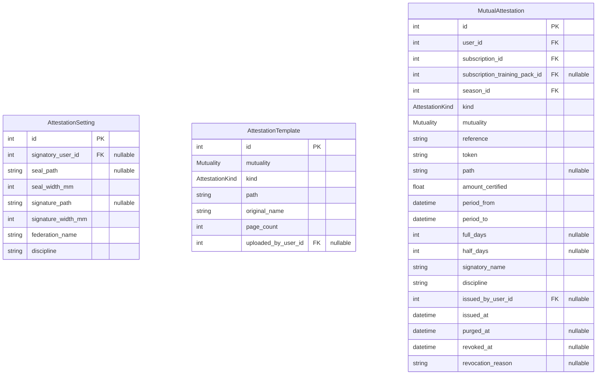

# ERD — ClubAdmin/Subscriptions/Attestations

```mermaid
erDiagram
    AttestationSetting {
        int id PK
        int signatory_user_id FK "nullable"
        string seal_path "nullable"
        int seal_width_mm
        string signature_path "nullable"
        int signature_width_mm
        string federation_name
        string discipline
    }
    AttestationTemplate {
        int id PK
        Mutuality mutuality
        AttestationKind kind
        string path
        string original_name
        int page_count
        int uploaded_by_user_id FK "nullable"
    }
    MutualAttestation {
        int id PK
        int user_id FK
        int subscription_id FK
        int subscription_training_pack_id FK "nullable"
        int season_id FK
        AttestationKind kind
        Mutuality mutuality
        string reference
        string token
        string path "nullable"
        float amount_certified
        datetime period_from
        datetime period_to
        int full_days "nullable"
        int half_days "nullable"
        string signatory_name
        string discipline
        int issued_by_user_id FK "nullable"
        datetime issued_at
        datetime purged_at "nullable"
        datetime revoked_at "nullable"
        string revocation_reason "nullable"
    }

```
