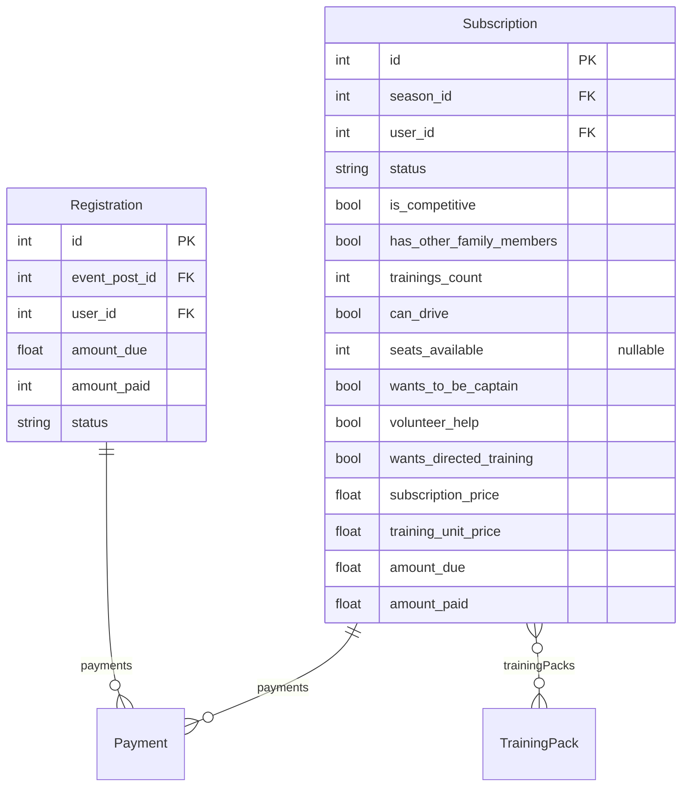

# ERD — ClubAdmin/Subscriptions

```mermaid
erDiagram
    Subscription {
        int id PK
        int season_id FK
        int user_id FK
        string status
        bool is_competitive
        bool has_other_family_members
        int trainings_count
        bool can_drive
        int seats_available "nullable"
        bool wants_to_be_captain
        bool volunteer_help
        bool wants_directed_training
        float subscription_price
        float training_unit_price
        float amount_due
        float amount_paid
    }
    Registration {
        int id PK
        int event_post_id FK
        int user_id FK
        float amount_due
        int amount_paid
        string status
    }

    Subscription ||--o{ Payment : "payments"
    Subscription }o--o{ TrainingPack : "trainingPacks"
    Registration ||--o{ Payment : "payments"
```
