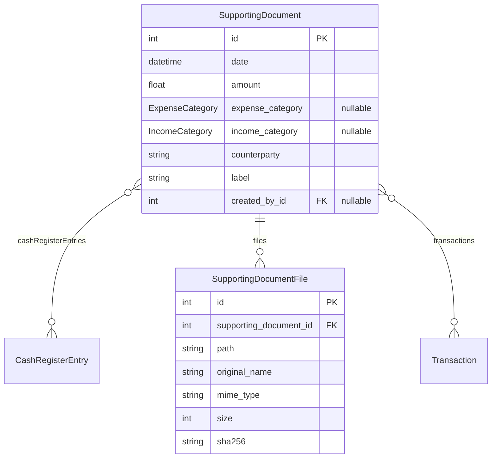

# ERD — ClubAdmin/SupportingDocuments

```mermaid
erDiagram
    SupportingDocument {
        int id PK
        datetime date
        float amount
        ExpenseCategory expense_category "nullable"
        IncomeCategory income_category "nullable"
        string counterparty
        string label
        int created_by_id FK "nullable"
    }
    SupportingDocumentFile {
        int id PK
        int supporting_document_id FK
        string path
        string original_name
        string mime_type
        int size
        string sha256
    }

    SupportingDocument }o--o{ CashRegisterEntry : "cashRegisterEntries"
    SupportingDocument ||--o{ SupportingDocumentFile : "files"
    SupportingDocument }o--o{ Transaction : "transactions"
```
