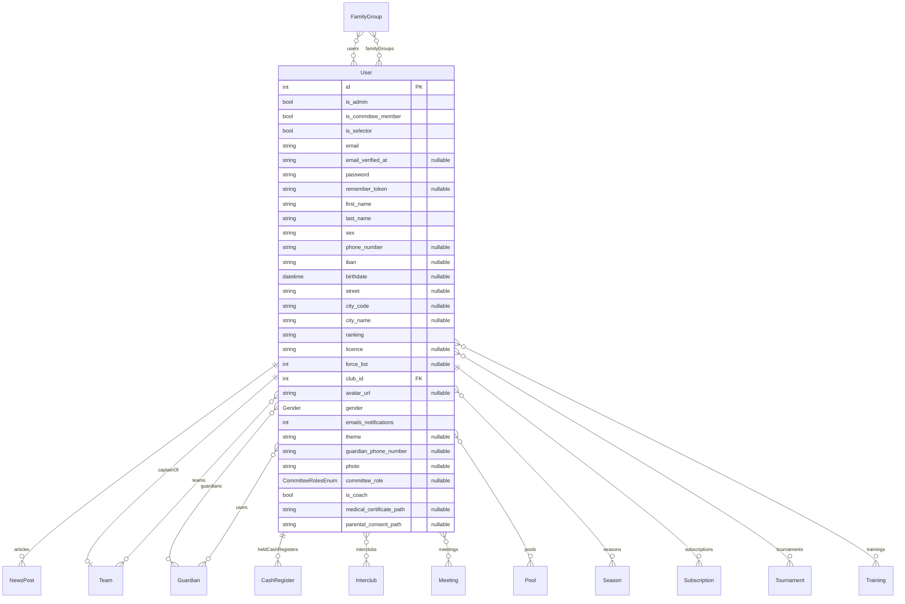

# ERD — ClubAdmin/Users

```mermaid
erDiagram
    FamilyGroup {
    }
    User {
        int id PK
        bool is_admin
        bool is_committee_member
        bool is_selector
        string email
        string email_verified_at "nullable"
        string password
        string remember_token "nullable"
        string first_name
        string last_name
        string sex
        string phone_number "nullable"
        string iban "nullable"
        datetime birthdate "nullable"
        string street "nullable"
        string city_code "nullable"
        string city_name "nullable"
        string ranking
        string licence "nullable"
        int force_list "nullable"
        int club_id FK
        string avatar_url "nullable"
        Gender gender
        int emails_notifications
        string theme "nullable"
        string guardian_phone_number "nullable"
        string photo "nullable"
        CommitteeRolesEnum committee_role "nullable"
        bool is_coach
        string medical_certificate_path "nullable"
        string parental_consent_path "nullable"
    }
    Guardian {
    }

    FamilyGroup }o--o{ User : "users"
    User ||--o{ NewsPost : "articles"
    User ||--o| Team : "captainOf"
    User }o--o{ FamilyGroup : "familyGroups"
    User }o--o{ Guardian : "guardians"
    User ||--o{ CashRegister : "heldCashRegisters"
    User }o--o{ Interclub : "interclubs"
    User }o--o{ Meeting : "meetings"
    User }o--o{ Pool : "pools"
    User }o--o{ Season : "seasons"
    User ||--o{ Subscription : "subscriptions"
    User }o--o{ Team : "teams"
    User }o--o{ Tournament : "tournaments"
    User }o--o{ Training : "trainings"
    Guardian }o--o{ User : "users"
```
