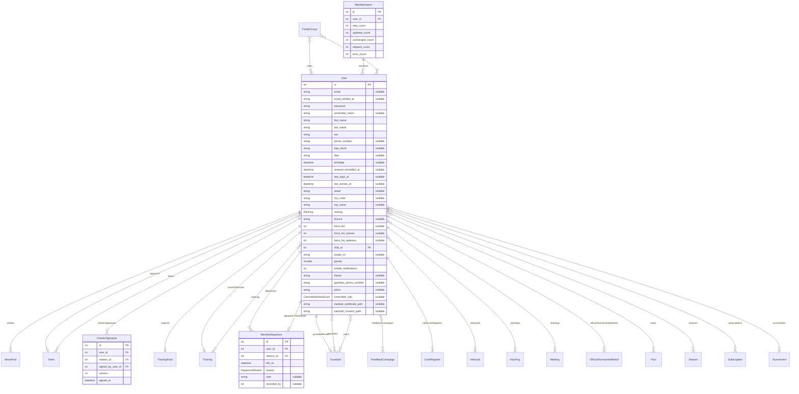

# ERD — ClubAdmin/Users

```mermaid
erDiagram
    CharterSignature {
        int id PK
        int user_id FK
        int season_id FK
        int signed_by_user_id FK
        int version
        datetime signed_at
    }
    FamilyGroup {
    }
    Guardian {
    }
    MemberDeparture {
        int id PK
        int user_id FK
        int season_id FK
        datetime left_on
        DepartureReason reason
        string note "nullable"
        int recorded_by "nullable"
    }
    MemberImport {
        int id PK
        int user_id FK
        int new_count
        int updated_count
        int unchanged_count
        int skipped_count
        int error_count
    }
    User {
        int id PK
        string email "nullable"
        string email_verified_at "nullable"
        string password
        string remember_token "nullable"
        string first_name
        string last_name
        string sex
        string phone_number "nullable"
        string duty_blurb "nullable"
        string iban "nullable"
        datetime birthdate "nullable"
        datetime renewal_reminded_at "nullable"
        datetime last_login_at "nullable"
        datetime last_activity_at "nullable"
        string street "nullable"
        string city_code "nullable"
        string city_name "nullable"
        Ranking ranking
        string licence "nullable"
        int force_list "nullable"
        int force_list_women "nullable"
        int force_list_veterans "nullable"
        int club_id FK
        string avatar_url "nullable"
        Gender gender
        int emails_notifications
        string theme "nullable"
        string guardian_phone_number "nullable"
        string photo "nullable"
        CommitteeRolesEnum committee_role "nullable"
        string medical_certificate_path "nullable"
        string parental_consent_path "nullable"
    }

    FamilyGroup }o--o{ User : "users"
    Guardian }o--o{ User : "users"
    MemberImport ||--o{ User : "members"
    User ||--o{ NewsPost : "articles"
    User ||--o| Team : "captainOf"
    User ||--o{ CharterSignature : "charterSignatures"
    User ||--o| TrainingPack : "coachOf"
    User ||--o| Training : "coachOfSession"
    User ||--o{ MemberDeparture : "departures"
    User ||--o| MemberDeparture : "departureThisSeason"
    User }o--o{ FamilyGroup : "familyGroups"
    User ||--o| Guardian : "guardianRecord"
    User }o--o{ FeedbackCampaign : "feedbackCampaigns"
    User }o--o{ Guardian : "guardians"
    User ||--o{ CashRegister : "heldCashRegisters"
    User }o--o{ Interclub : "interclubs"
    User ||--o{ KeyRing : "keyRings"
    User }o--o{ Meeting : "meetings"
    User ||--o{ OfficialTournamentMatch : "officialTournamentMatches"
    User }o--o{ Pool : "pools"
    User }o--o{ Season : "seasons"
    User ||--o{ Subscription : "subscriptions"
    User }o--o{ Team : "teams"
    User }o--o{ Tournament : "tournaments"
    User }o--o{ Training : "trainings"
```
