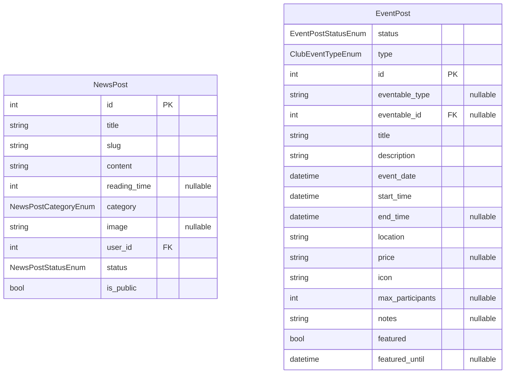

# ERD — ClubPosts

```mermaid
erDiagram
    NewsPost {
        int id PK
        string title
        string slug
        string content
        int reading_time "nullable"
        NewsPostCategoryEnum category
        string image "nullable"
        int user_id FK
        NewsPostStatusEnum status
        bool is_public
    }
    EventPost {
        EventPostStatusEnum status
        ClubEventTypeEnum type
        int id PK
        string eventable_type "nullable"
        int eventable_id FK "nullable"
        string title
        string description
        datetime event_date
        datetime start_time
        datetime end_time "nullable"
        string location
        string price "nullable"
        string icon
        int max_participants "nullable"
        string notes "nullable"
        bool featured
        datetime featured_until "nullable"
    }

```
