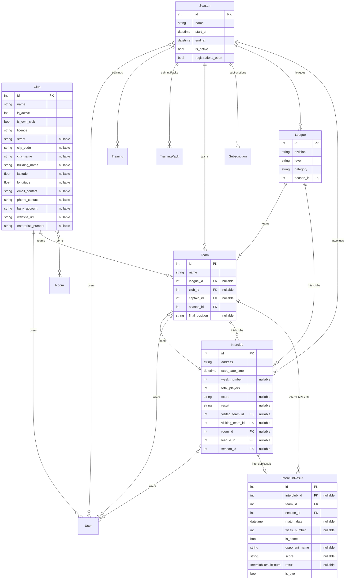

# ERD — Competitions/Interclub

```mermaid
erDiagram
    Club {
        int id PK
        string name
        int is_active
        bool is_own_club
        string licence
        string street "nullable"
        string city_code "nullable"
        string city_name "nullable"
        string building_name "nullable"
        float latitude "nullable"
        float longitude "nullable"
        string email_contact "nullable"
        string phone_contact "nullable"
        string bank_account "nullable"
        string website_url "nullable"
        string enterprise_number "nullable"
    }
    Interclub {
        int id PK
        string address
        datetime start_date_time
        int week_number "nullable"
        int total_players
        string score "nullable"
        string result "nullable"
        int visited_team_id FK "nullable"
        int visiting_team_id FK "nullable"
        int room_id FK "nullable"
        int league_id FK "nullable"
        int season_id FK "nullable"
    }
    InterclubResult {
        int id PK
        int interclub_id FK "nullable"
        int team_id FK
        int season_id FK
        datetime match_date "nullable"
        int week_number "nullable"
        bool is_home
        string opponent_name "nullable"
        string score "nullable"
        InterclubResultEnum result "nullable"
        bool is_bye
    }
    League {
        int id PK
        string division
        string level
        string category
        int season_id FK
    }
    Season {
        int id PK
        string name
        datetime start_at
        datetime end_at
        bool is_active
        bool registrations_open
    }
    Team {
        int id PK
        string name
        int league_id FK "nullable"
        int club_id FK "nullable"
        int captain_id FK "nullable"
        int season_id FK
        string final_position "nullable"
    }

    Club }o--o{ Room : "rooms"
    Club ||--o{ Team : "teams"
    Club ||--o{ User : "users"
    Interclub ||--o| InterclubResult : "interclubResult"
    Interclub ||--o{ Team : "teams"
    Interclub }o--o{ User : "users"
    League ||--o{ Interclub : "interclubs"
    League ||--o{ Team : "teams"
    Season ||--o{ Interclub : "interclubs"
    Season ||--o{ League : "leagues"
    Season ||--o{ Subscription : "subscriptions"
    Season ||--o{ Team : "teams"
    Season ||--o{ TrainingPack : "trainingPacks"
    Season ||--o{ Training : "trainings"
    Season }o--o{ User : "users"
    Team ||--o{ InterclubResult : "interclubResults"
    Team ||--o{ Interclub : "interclubs"
    Team }o--o{ User : "users"
```
