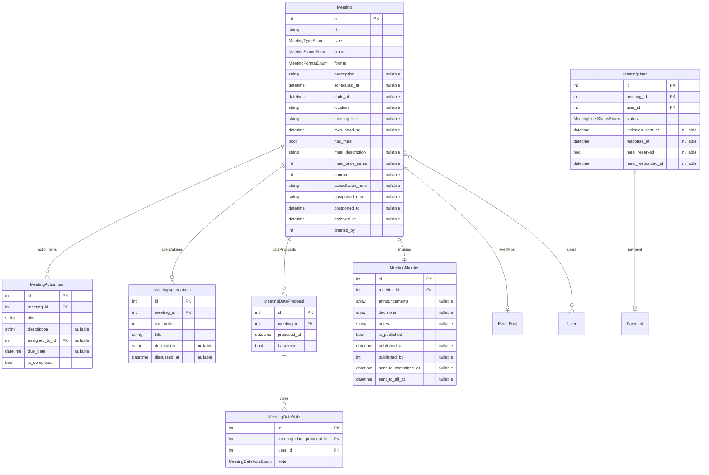

# ERD — Meetings

```mermaid
erDiagram
    Meeting {
        int id PK
        string title
        MeetingTypeEnum type
        MeetingStatusEnum status
        MeetingFormatEnum format
        string description "nullable"
        datetime scheduled_at "nullable"
        datetime ends_at "nullable"
        string location "nullable"
        string meeting_link "nullable"
        datetime rsvp_deadline "nullable"
        bool has_meal
        string meal_description "nullable"
        int meal_price_cents "nullable"
        int quorum "nullable"
        string cancellation_note "nullable"
        string postponed_note "nullable"
        datetime postponed_to "nullable"
        datetime archived_at "nullable"
        int created_by
    }
    MeetingActionItem {
        int id PK
        int meeting_id FK
        string title
        string description "nullable"
        int assigned_to_id FK "nullable"
        datetime due_date "nullable"
        bool is_completed
    }
    MeetingAgendaItem {
        int id PK
        int meeting_id FK
        int sort_order
        string title
        string description "nullable"
        datetime discussed_at "nullable"
    }
    MeetingDateProposal {
        int id PK
        int meeting_id FK
        datetime proposed_at
        bool is_selected
    }
    MeetingDateVote {
        int id PK
        int meeting_date_proposal_id FK
        int user_id FK
        MeetingDateVoteEnum vote
    }
    MeetingMinutes {
        int id PK
        int meeting_id FK
        array announcements "nullable"
        array decisions "nullable"
        string notes "nullable"
        bool is_published
        datetime published_at "nullable"
        int published_by "nullable"
        datetime sent_to_committee_at "nullable"
        datetime sent_to_all_at "nullable"
    }
    MeetingUser {
        int id PK
        int meeting_id FK
        int user_id FK
        MeetingUserStatusEnum status
        datetime invitation_sent_at "nullable"
        datetime response_at "nullable"
        bool meal_reserved "nullable"
        datetime meal_responded_at "nullable"
    }

    Meeting ||--o{ MeetingActionItem : "actionItems"
    Meeting ||--o{ MeetingAgendaItem : "agendaItems"
    Meeting ||--o{ MeetingDateProposal : "dateProposals"
    Meeting ||--o| EventPost : "eventPost"
    Meeting ||--o| MeetingMinutes : "minutes"
    Meeting }o--o{ User : "users"
    MeetingDateProposal ||--o{ MeetingDateVote : "votes"
    MeetingUser ||--o| Payment : "payment"
```
