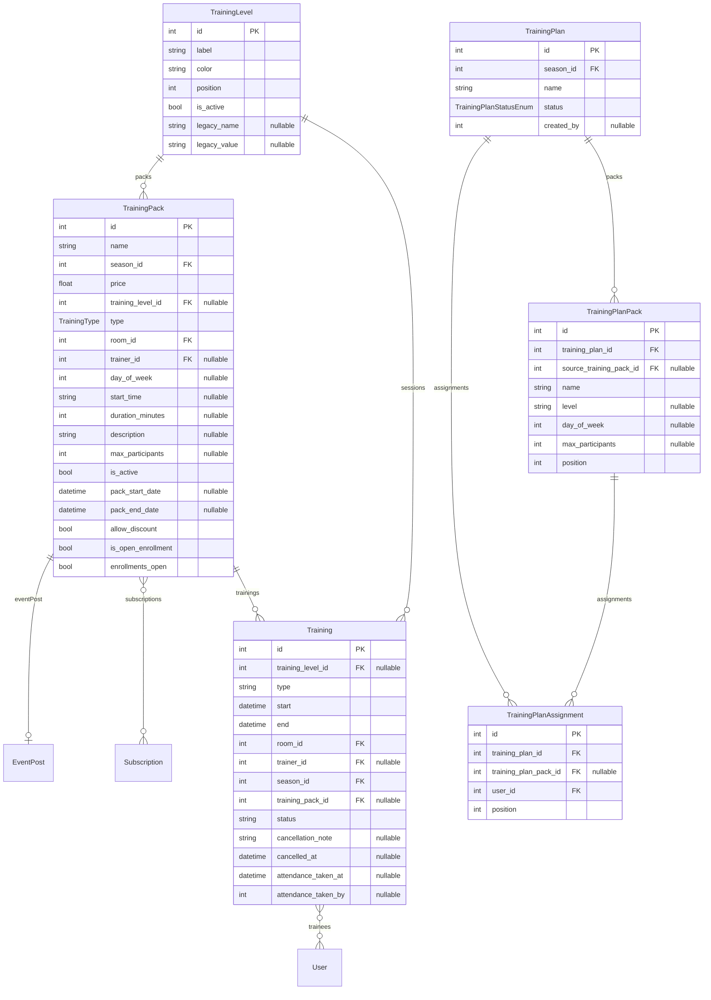

# ERD — Trainings

```mermaid
erDiagram
    Training {
        int id PK
        int training_level_id FK "nullable"
        string type
        datetime start
        datetime end
        int room_id FK
        int trainer_id FK "nullable"
        int season_id FK
        int training_pack_id FK "nullable"
        string status
        string cancellation_note "nullable"
        datetime cancelled_at "nullable"
        datetime attendance_taken_at "nullable"
        int attendance_taken_by "nullable"
    }
    TrainingLevel {
        int id PK
        string label
        string color
        int position
        bool is_active
        string legacy_name "nullable"
        string legacy_value "nullable"
    }
    TrainingPack {
        int id PK
        string name
        int season_id FK
        float price
        int training_level_id FK "nullable"
        TrainingType type
        int room_id FK
        int trainer_id FK "nullable"
        int day_of_week "nullable"
        string start_time "nullable"
        int duration_minutes "nullable"
        string description "nullable"
        int max_participants "nullable"
        bool is_active
        datetime pack_start_date "nullable"
        datetime pack_end_date "nullable"
        bool allow_discount
        bool is_open_enrollment
        bool enrollments_open
    }
    TrainingPlan {
        int id PK
        int season_id FK
        string name
        TrainingPlanStatusEnum status
        int created_by "nullable"
    }
    TrainingPlanAssignment {
        int id PK
        int training_plan_id FK
        int training_plan_pack_id FK "nullable"
        int user_id FK
        int position
    }
    TrainingPlanPack {
        int id PK
        int training_plan_id FK
        int source_training_pack_id FK "nullable"
        string name
        string level "nullable"
        int day_of_week "nullable"
        int max_participants "nullable"
        int position
    }

    Training }o--o{ User : "trainees"
    TrainingLevel ||--o{ TrainingPack : "packs"
    TrainingLevel ||--o{ Training : "sessions"
    TrainingPack ||--o| EventPost : "eventPost"
    TrainingPack }o--o{ Subscription : "subscriptions"
    TrainingPack ||--o{ Training : "trainings"
    TrainingPlan ||--o{ TrainingPlanAssignment : "assignments"
    TrainingPlan ||--o{ TrainingPlanPack : "packs"
    TrainingPlanPack ||--o{ TrainingPlanAssignment : "assignments"
```
